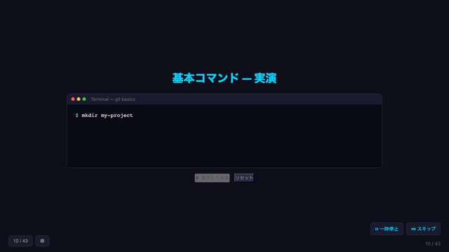

# Git & GitHub 入門シリーズ

AIと一緒に学ぶバージョン管理 — インタラクティブなスライド集



## スライド一覧

| # | 編 | 内容 |
|---|------|------|
| 1 | [Git入門編](slides/git-intro.html) | Gitの基礎、環境構築、基本コマンド、個人開発、AI活用 |
| 2 | [初学者あるある編](slides/beginners-tips.html) | コミットの悩み、メッセージの書き方、よくあるミスと対処法 |
| 3 | [インタラクティブツール編](slides/github-tools.html) | GitHub Pages、Actions、Releases、Packages、Projects |
| 4 | [アプリ開発編](slides/app-dev.html) | プロジェクト構成、package.json、ビルドツール、デプロイ |
| 5 | [チーム開発編](slides/team-dev.html) | ブランチ戦略、コードレビュー、CODEOWNERS、Protected Branches |
| 6 | [CI/CD編](slides/ci-cd.html) | GitHub Actions、テスト自動化、自動デプロイ、ワークフロー構文 |
| 7 | [セキュリティ編](slides/security.html) | Secrets管理、Dependabot、署名付きコミット |
| 8 | [Issue & PR活用編](slides/issue-pr.html) | テンプレート、ラベル運用、レビュープロセス、Discussions |
| 9 | [OSS参加編](slides/oss.html) | Fork & Contribute、ライセンス、CLA |
| 10 | [GitHub CLI編](slides/gh-cli.html) | ghコマンド、エイリアス、スクリプト連携 |
| 11 | [Git上級編](slides/git-advanced.html) | rebase、cherry-pick、bisect、submodule、worktree |

## 操作方法

`→` `←` スライド移動 / `S` スキップ / `P` 一時停止 / `G` 最後へ / `g` 最初へ

## 技術

自己完結型HTML（CDN依存なし） / [terminal-slide](https://github.com/lutelute/terminal-slide) でローカルプレビュー可

---

## 番外編：この資料の作り方

本スライド集は [terminal-slide](https://github.com/lutelute/terminal-slide) と Claude Code を使って作成しました。以下がざっくりとしたプロンプトの流れです。

```
1. 「Git入門のインタラクティブスライドをHTMLで作って。
     ターミナル風のタイプライターアニメーション付きで」

2. 「残り9編（ツール編〜上級編）も同じフォーマットで一括生成して」

3. 「全スライドにスキップ(S)・一時停止(P)ボタンと
     コマンドリファレンスの付録スライドを追加して」

4. 「各編の冒頭にアウトライン（この編の全体像）スライドを入れて」

5. 「index.htmlにランディングページを作って、
     学習ロードマップと難易度バッジを付けて」

6. 「ターミナルデモの横にGitHub UI風のビジュアルを並べて、
     コマンド実行と同期してアニメーションさせて」

7. 「初学者あるある編を新規追加して。
     コンセプトスライド（用語解説、ローカル/リモートの関係図）も入れて」

8. 「ギャラリービュー（全スライド一覧）と
     ステップ進捗バーを全編に追加して」
```

各ステップで生成 → 確認 → 修正を繰り返し、全11編・計43+スライドを構築しました。
